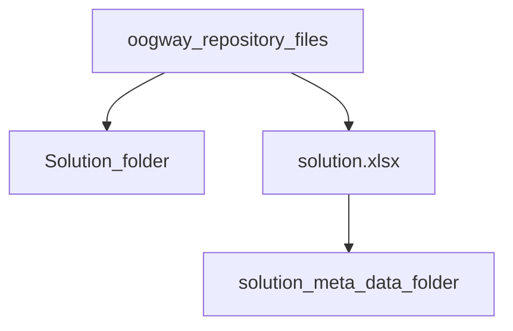
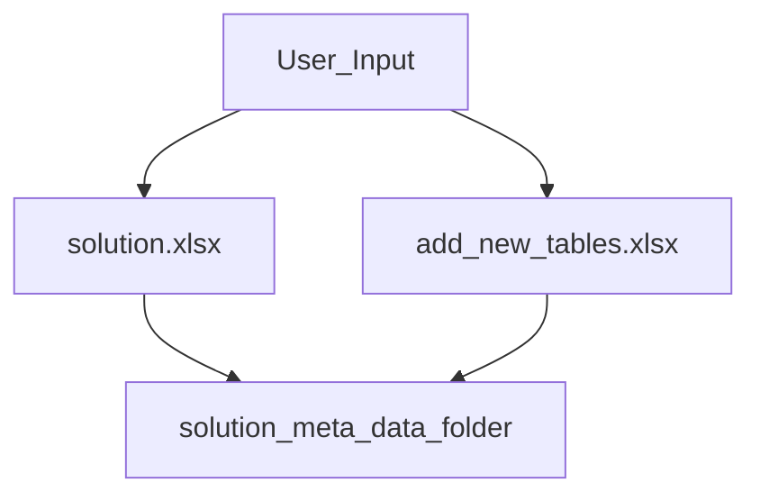
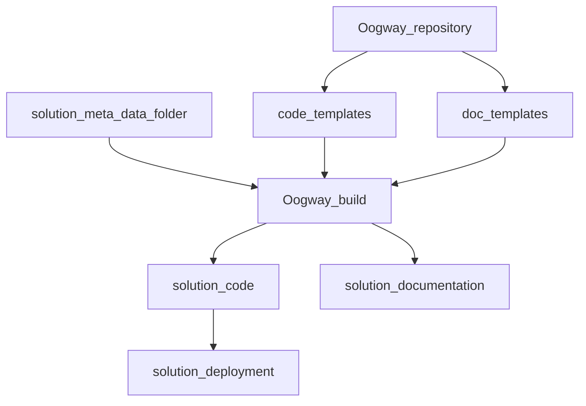
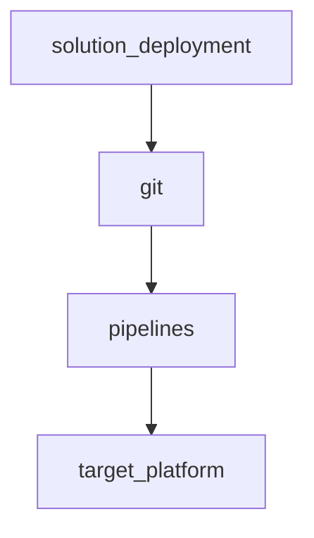

Oogway
-------------------------------------------------------
Initialzie a new solution

use py ./oogwaypy -p [path to your solution folder] -a init

Design Time
This is where you design your tables.
use py ./oogwaypy -p [path to your solution folder] -a add [table_name] to add a new table to your solution.

Build
py ./oogway.py p [path_to_your_soltion_folder] -a build

Deploy
